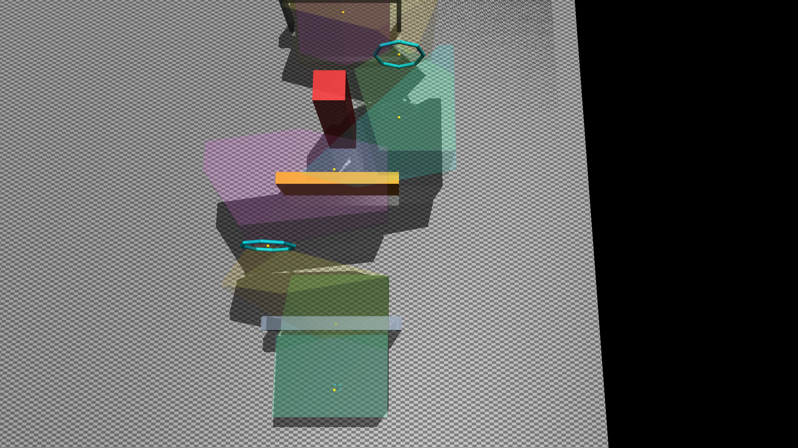
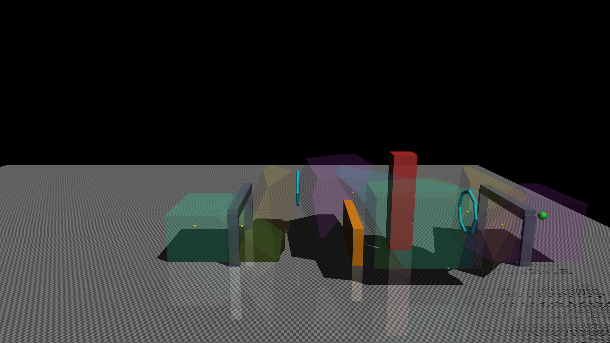

## 3D UAV simulation and autonomous control for path tracking

This project is developed on top of
[Mdhvince/UAV-Autonomous-control](https://github.com/Mdhvince/UAV-Autonomous-control).
The upstream repository provides the original MuJoCo quadrotor simulation and
basic trajectory-tracking foundation. This version extends it with
geometry-aware planning, model-predictive control, and a wind-disturbance
environment.

## Current work and future work

- [x] Construct collision-free convex flight corridors with FIRI
- [x] Optimize geometrically constrained trajectories with GCOPTER/MINCO
- [x] Plan through a graph of convex regions with GCS
- [x] Implement an acados-based nonlinear MPC trajectory-tracking controller
- [x] Build a deterministic wind-disturbance simulation environment
- [ ] Implement a reinforcement-learning controller for trajectory tracking
- [ ] Implement a differentiable MPC trajectory-tracking controller with reinforcement learning under wind disturbance
- [ ] Implement motion-planning diffusion
- [ ] Implement Biconvex Optimization for Smooth Minimum-Time Trajectories around Convex Obstacles

Compared with the upstream repository, the main additions are FIRI safe-region
construction, GCOPTER trajectory optimization, GCS route and trajectory
optimization, acados MPC, terminal feedback, and deterministic wind-disturbance
experiments.

## Experiment videos

The videos show the implemented planning and tracking pipelines in MuJoCo. The
orange curve is the planned trajectory and the blue curve is the actual flight
path. Convex regions are not drawn in the videos; they are shown separately in
the FIRI figures below.

### GCOPTER + Cascaded Controller

<!-- To embed the video inline, replace the link below with the real GitHub user-attachments URL. -->
[Watch video](docs/videos/gcopter_cascaded.mp4)
https://github.com/user-attachments/assets/bba68e1c-c61f-4ca4-8f51-0023d9bb6baf
**Planner:** FIRI + GCOPTER  
**Controller:** Cascaded controller

### Minimum Snap + Cascaded Controller

<!-- To embed the video inline, replace the link below with the real GitHub user-attachments URL. -->
[Watch video](docs/videos/minisnap_cascaded.mp4)
https://github.com/user-attachments/assets/9577ae10-fcef-4651-a194-e1081d483aec
**Planner:** Minimum Snap baseline  
**Controller:** Cascaded controller

### GCS + MPC

<!-- To embed the video inline, replace the link below with the real GitHub user-attachments URL. -->
[Watch video](docs/videos/gcs_mpc.mp4)
https://github.com/user-attachments/assets/963147b2-71ac-4242-9ae7-1ec44c2c17db
**Planner:** GCS  
**Controller:** Nonlinear MPC

## Methods

### FIRI

FIRI (Fast Iterative Regional Inflation) converts obstacle-free seed points or
path segments into large convex regions that can be used as a safe flight
corridor. Each region is stored in half-space form,

```math
\mathcal{P}
=
\left\{
\mathbf{x}\in\mathbb{R}^{3}
\mid
A\mathbf{x}\le \mathbf{b}
\right\}.
```
FIRI alternates between two operations:

1. **Restrictive Inflation (RsI):** construct separating half-spaces that exclude
   obstacles while keeping the prescribed seed set inside the region.
2. **Maximum-Volume Inscribed Ellipsoid (MVIE):** enlarge an ellipsoid inside the
   current polytope and use it to guide the next inflation step.

For an ellipsoid

```math
\mathcal{E}(C,\mathbf{d})
=
\left\{
C\mathbf{u}+\mathbf{d}
\mid
\|\mathbf{u}\|_2\le 1
\right\},
```
contained in a polytope
$\mathcal{P}=\{\mathbf{x}\mid \mathbf{a}_j^\top\mathbf{x}\le b_j\}$,
the containment constraints can be written as

```math
\|C^\top\mathbf{a}_j\|_2
+
\mathbf{a}_j^\top\mathbf{d}
\le b_j,
\qquad \forall j.
```
The resulting overlapping convex polytopes form the safe flight corridor used
by the trajectory optimizers.






### GCOPTER / MINCO

GCOPTER performs continuous trajectory optimization inside the convex corridor.
Its key component is MINCO, a sparse polynomial trajectory representation that
eliminates the full set of polynomial coefficients and exposes only a compact
set of spatial and temporal decision variables.

For segment $i$, a polynomial trajectory can be written as

```math
\mathbf{p}_i(t)
=
C_i^\top\boldsymbol{\beta}(t),
\qquad
\boldsymbol{\beta}(t)
=
[1,t,\ldots,t^{2s-1}]^\top ,
\qquad
t\in[0,T_i].
```
MINCO exploits the optimality conditions of the unconstrained control-effort
problem to recover the coefficients from the intermediate states and segment
durations,

```math
C
=
\mathcal{M}(\mathbf{q},\mathbf{T}),
```
so the optimizer works with the much smaller variable set
$(\mathbf{q},\mathbf{T})$ rather than directly optimizing every polynomial
coefficient. In this project, the implemented planner uses the $s=3$ MINCO
variant, giving piecewise quintic trajectories.

A representative GCOPTER objective is

```math
J(\mathbf{q},\mathbf{T})
=
\int_{0}^{T_\Sigma}
\left\|
\mathbf{p}^{(s)}(t)
\right\|_2^2\,dt
+
\rho T_\Sigma
+
J_{\mathrm{pen}},
\qquad
T_\Sigma=\sum_i T_i .
```
The first term penalizes control effort, the second trades trajectory duration
against smoothness, and $J_{\mathrm{pen}}$ collects violations of state-input
constraints. In the implementation, velocity, acceleration, thrust, tilt-angle,
and body-rate constraints are evaluated along the trajectory and introduced
through smooth integrated penalties.

Geometric feasibility is handled through smooth mappings that keep the spatial
decision variables inside the corresponding convex corridor. Segment durations
are parameterized to remain positive. The resulting unconstrained nonlinear
problem is optimized with L-BFGS.

Compared with a waypoint-only minimum-snap baseline, GCOPTER jointly reshapes
the trajectory and reallocates segment time while accounting for both corridor
geometry and multicopter feasibility.

### GCS

Graph of Convex Sets (GCS) treats each collision-free convex region as a graph
vertex and feasible transitions between overlapping regions as graph edges,

```math
G=(V,E),
\qquad
v\in V
\longleftrightarrow
\mathcal{X}_v\subset\mathbb{R}^n .
```
A trajectory segment inside a region is represented with a Bézier curve,

```math
\mathbf{r}_v(\tau)
=
\sum_{k=0}^{d}
B_{k,d}(\tau)\mathbf{P}_{v,k},
\qquad
\tau\in[0,1],
```
where $B_{k,d}$ are Bernstein basis polynomials. Because a Bézier curve lies in
the convex hull of its control points, imposing

```math
\mathbf{P}_{v,k}\in\mathcal{X}_v
```
guarantees that the entire segment remains inside the convex region.

Discrete route selection can be described with edge variables $z_e$. The graph
flow constraints have the form

```math
\sum_{e\in\delta^{+}(v)} z_e
-
\sum_{e\in\delta^{-}(v)} z_e
=
\begin{cases}
1, & v=s,\\
-1, & v=t,\\
0, & \text{otherwise},
\end{cases}
```
with $z_e\in\{0,1\}$ in the mixed-integer formulation. GCS applies perspective
reformulations and relaxes these variables to obtain a tight convex relaxation;
a discrete path is then recovered by rounding, followed by a convex restriction
on that path.

Therefore, GCS couples

1. discrete selection of a sequence of convex regions;
2. continuous Bézier control-point optimization;
3. region-membership, connection, and smoothness constraints; and
4. convex trajectory costs

within one optimization framework.

The example in this repository uses a two-storey MuJoCo building maze and a
convex cover of its collision-free volume.

### Nonlinear MPC

Trajectory tracking is formulated as a finite-horizon nonlinear optimal-control
problem. Using the discrete dynamics

```math
\mathbf{x}_{k+1}
=
f_d(\mathbf{x}_k,\mathbf{u}_k),
```
the controller repeatedly solves

```math
\min_{\mathbf{u}_{0:N-1}}
\;
\sum_{k=0}^{N-1}
\left(
\|\mathbf{x}_k-\mathbf{x}^{\mathrm{ref}}_k\|_Q^2
+
\|\mathbf{u}_k-\mathbf{u}^{\mathrm{ref}}_k\|_R^2
\right)
+
\|\mathbf{x}_N-\mathbf{x}^{\mathrm{ref}}_N\|_{Q_f}^2 ,
```
subject to the vehicle dynamics and the controller's state/input bounds. Only
the first optimized control is applied before the problem is solved again at the
next control step.

The implementation uses **acados** as the nonlinear optimal-control solver and
adds terminal feedback for improved tracking robustness.

### Planned: Biconvex Minimum-Time Planning

The planned biconvex planner targets smooth minimum-time trajectories around
convex obstacles while supporting derivative constraints of arbitrary order.
The original method reformulates the duration and derivative constraints through
a change of variables and enforces collision avoidance with time-varying
separating hyperplanes.

Its computation alternates between two convex subproblems:

1. optimize maximum-margin separating planes for the obstacles currently
   intersected by the trajectory;
2. optimize the smooth trajectory while holding those planes fixed.

This produces an anytime biconvex algorithm that can start from a simple
collision-free polygonal path without first constructing a full convex
decomposition of free space.


## Setup and running

### Requirements

- Python 3.13 or newer
- [`uv`](https://docs.astral.sh/uv/)
- MuJoCo 3.3 or newer

Install the environment from the repository root:

```bash
uv sync
```

Run the main MuJoCo simulation:

```bash
uv run python -m uav_ac.main
```

The main program loads the selected scene, plans the trajectory, and tracks it
in the MuJoCo viewer. Press `Backspace` in the viewer to reset and replay the
simulation.

Select the planner and controller near the top of `uav_ac/main.py`:

```python
PLANNER = "gcs"          # "gcopter", "gcs", or "mini_snap"
CONTROLLER = "mpc"       # "mpc" or "cascaded"
```

The GCS planner uses `gcs_building.xml`. GCOPTER and Minimum Snap use
`lab_course.xml`.

Run the wind-disturbance environment:

```bash
uv run python -m uav_ac.wind
```

The controller used by the wind example is selected through `CONTROLLER` in
`uav_ac/wind.py`.

Run the planning tests:

```bash
uv run pytest tests/unit/planning
```

## Coordinate convention

Planning and control use the aerospace NED/FRD convention:

- `x`: north/forward
- `y`: east/right
- `z`: down; altitude is represented by a negative `z`

The MuJoCo adapter converts between this convention and MuJoCo's ENU/FLU
world and body conventions.

## Repository structure

```text
uav_ac/
├── planning/
│   ├── corridor/firi/       FIRI convex safe regions
│   ├── trajectory/gcopter/   GCOPTER, MINCO, and constrained optimization
│   ├── trajectory/gcs/       GCS graph and continuous Bézier optimization
│   └── pipeline/             mission-level planning composition
├── control/                  MPC, cascaded control, and trajectory scheduler
├── simulation/               MuJoCo dynamics and scene definitions
├── main.py                   main simulation entry point
└── wind.py                   wind-disturbance environment
```

## References

1. Mdhvince, **UAV-Autonomous-control**. GitHub repository.  
   https://github.com/Mdhvince/UAV-Autonomous-control

2. Z. Wang, X. Zhou, C. Xu, and F. Gao, “Geometrically Constrained Trajectory
   Optimization for Multicopters,” *IEEE Transactions on Robotics*, vol. 38,
   no. 5, pp. 3259–3278, 2022.  
   DOI: https://doi.org/10.1109/TRO.2022.3160022

3. Q. Wang, Z. Wang, M. Wang, J. Ji, Z. Han, T. Wu, R. Jin, Y. Gao, C. Xu, and
   F. Gao, “Fast Iterative Region Inflation for Computing Large 2-D/3-D Convex
   Regions of Obstacle-Free Space,” *IEEE Transactions on Robotics*, vol. 41,
   pp. 3223–3243, 2025.  
   DOI: https://doi.org/10.1109/TRO.2025.3562482

4. T. Marcucci, M. Petersen, D. von Wrangel, and R. Tedrake, “Motion Planning
   around Obstacles with Convex Optimization,” *Science Robotics*, vol. 8,
   no. 84, eadf7843, 2023.  
   DOI: https://doi.org/10.1126/scirobotics.adf7843

5. D. Mellinger and V. Kumar, “Minimum Snap Trajectory Generation and Control
   for Quadrotors,” in *2011 IEEE International Conference on Robotics and
   Automation (ICRA)*, pp. 2520–2525, 2011.  
   DOI: https://doi.org/10.1109/ICRA.2011.5980409

6. R. Verschueren, G. Frison, D. Kouzoupis, J. Frey, N. van Duijkeren,
   A. Zanelli, B. Novoselnik, T. Albin, R. Quirynen, and M. Diehl,
   “acados—a modular open-source framework for fast embedded optimal control,”
   *Mathematical Programming Computation*, vol. 14, no. 1, pp. 147–183, 2022.  
   DOI: https://doi.org/10.1007/s12532-021-00208-8

7. P. Werner, T. Marcucci, and D. Rus, “Biconvex Optimization for Smooth
   Minimum-Time Trajectories around Convex Obstacles,” *arXiv preprint
   arXiv:2608.02834*, 2026. Submitted to *IEEE Transactions on Robotics*.  
   https://arxiv.org/abs/2608.02834
