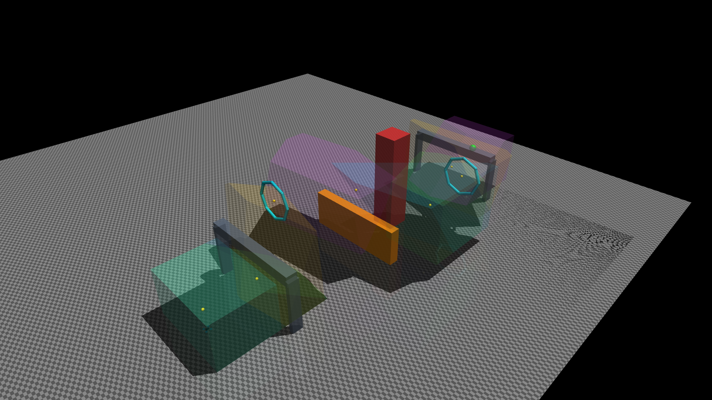

## LearnOpt Motion Planning
Learning and Optimization for Robot Motion Planning and Control.

This repository documents my exploration and implementation of interesting methods at the intersection of learning and optimization, with a focus on robot motion planning and control.

This project is developed on top of
[Mdhvince/UAV-Autonomous-control](https://github.com/Mdhvince/UAV-Autonomous-control), which provides the original MuJoCo quadrotor simulation and basic trajectory-tracking framework. LearnOpt extends it with optimization-based motion planning, model-predictive control, wind-disturbance simulation, and, progressively, learning-based planning and control methods.

## Current work and future work

- [x] Construct collision-free convex flight corridors with FIRI
- [x] Optimize geometrically constrained trajectories with GCOPTER/MINCO
- [x] Plan through a graph of convex regions with GCS
- [x] Implement an acados-based nonlinear MPC trajectory-tracking controller
- [x] Build a deterministic wind-disturbance simulation environment
- [x] Implement a PPO reinforcement-learning controller for trajectory tracking
- [ ] Implement a differentiable MPC trajectory-tracking controller with reinforcement learning under wind disturbance
  - SB3 AC-MPC implementation and short-run workflow: [documentation](uav_ac/rl/acmpc/acmpc.md).
- [ ] Implement motion-planning diffusion
- [ ] Implement Biconvex Optimization for Smooth Minimum-Time Trajectories around Convex Obstacles

Compared with the upstream repository, the main additions are FIRI safe-region
construction, GCOPTER trajectory optimization, GCS route and trajectory
optimization, acados MPC, terminal feedback, and deterministic wind-disturbance
experiments.

## Experiment videos

The videos show the implemented planning and tracking pipelines in MuJoCo. The
orange curve is the planned trajectory and the blue curve is the actual flight
path. Convex regions are not drawn in the videos; they are shown separately in
the FIRI figures below.

### GCOPTER + MPC

https://github.com/user-attachments/assets/b8622729-85a3-48b4-996e-c6940f82b589

**Planner:** FIRI + GCOPTER  
**Controller:** MPC

### Minimum Snap + Cascaded

https://github.com/user-attachments/assets/21c21263-08e6-4232-9e44-911eec212278

**Planner:** Minimum Snap baseline  
**Controller:** Cascaded

### GCS + MPC

https://github.com/user-attachments/assets/0cb63fd2-9fe3-4f56-8253-874900b20b00

**Planner:** GCS  
**Controller:** Nonlinear MPC

## Methods

### FIRI

FIRI constructs collision-free convex regions around seed points or path segments to form a safe flight corridor. Each region is represented in half-space form,

```math
\mathcal{P}
=
\left\{
\mathbf{x}\in\mathbb{R}^{3}
\mid
A\mathbf{x}\le \mathbf{b}
\right\}.
```

The algorithm alternates between obstacle-separating half-space construction and maximum-volume inscribed ellipsoid (MVIE) optimization. The resulting overlapping polytopes are used as geometric constraints for trajectory optimization.



### GCOPTER / MINCO

GCOPTER optimizes smooth multicopter trajectories inside the convex corridor using the MINCO representation. For segment $i$,

```math
\mathbf{p}_i(t)
=
C_i^\top\boldsymbol{\beta}(t),
\qquad
\boldsymbol{\beta}(t)
=
[1,t,\ldots,t^{2s-1}]^\top .
```

MINCO recovers the polynomial coefficients from compact spatial and temporal variables,

```math
C
=
\mathcal{M}(\mathbf{q},\mathbf{T}),
```

so the optimizer works directly with $(\mathbf{q},\mathbf{T})$. This project uses the $s=3$ variant, corresponding to piecewise quintic trajectories.

A representative objective is

```math
J
=
\int_{0}^{T_\Sigma}
\left\|
\mathbf{p}^{(s)}(t)
\right\|_2^2\,dt
+
\rho T_\Sigma
+
J_{\mathrm{pen}},
```

where $J_{\mathrm{pen}}$ includes geometric and multicopter feasibility penalties. The resulting unconstrained nonlinear problem is optimized with L-BFGS.

### GCS

Graph of Convex Sets (GCS) represents each collision-free convex region as a graph vertex,

```math
G=(V,E),
\qquad
v\in V
\longleftrightarrow
\mathcal{X}_v .
```

A trajectory segment inside region $\mathcal{X}_v$ is represented by a Bézier curve,

```math
\mathbf{r}_v(\tau)
=
\sum_{k=0}^{d}
B_{k,d}(\tau)\mathbf{P}_{v,k},
\qquad
\mathbf{P}_{v,k}\in\mathcal{X}_v .
```

Because a Bézier curve lies in the convex hull of its control points, the region constraint guarantees that the whole segment remains inside the convex set. GCS uses convex relaxation to jointly handle discrete region selection and continuous trajectory optimization.

### Nonlinear MPC

Trajectory tracking is formulated as a finite-horizon nonlinear optimal-control problem with

```math
\mathbf{x}_{k+1}
=
f_d(\mathbf{x}_k,\mathbf{u}_k),
```

and objective

```math
\min_{\mathbf{u}_{0:N-1}}
\sum_{k=0}^{N-1}
\left(
\|\mathbf{x}_k-\mathbf{x}^{\mathrm{ref}}_k\|_Q^2
+
\|\mathbf{u}_k-\mathbf{u}^{\mathrm{ref}}_k\|_R^2
\right)
+
\|\mathbf{x}_N-\mathbf{x}^{\mathrm{ref}}_N\|_{Q_f}^2 .
```

The controller is implemented with **acados** and applies the first optimized input in a receding-horizon manner. Terminal feedback is added to improve tracking robustness.

### Planned: Biconvex Minimum-Time Planning

The planned biconvex planner targets smooth minimum-time trajectories around convex obstacles with derivative constraints. It alternates between optimizing obstacle-separating hyperplanes and optimizing the trajectory with those hyperplanes fixed.

This yields an anytime biconvex optimization procedure that can start from a collision-free polygonal path without requiring a complete convex decomposition of the free space.


## Setup and running

### Requirements

- Python 3.13
- [`uv`](https://docs.astral.sh/uv/) (recommended; a standard virtual environment and pip also work)
- MuJoCo 3.3 or newer
- FFmpeg (only required for recording videos)

Install uv, then create the project environment from the repository root:

```bash
uv sync --python 3.13
```

The default installation includes the planners, MuJoCo simulation, CasADi,
MPC Python dependencies, PPO/RL dependencies, and test tools. MPC still
requires the separately built acados toolchain described below.

Training uses 200 MPC-validated GCOPTER trajectories in an open scene, with 20
validation and 20 test trajectories. Edit `configs/ppo_trajectory.yaml` for
trajectory, wind, and PPO settings.

```bash
uv run python -m uav_ac.rl.mlp_baseline.training \
  --config configs/ppo_trajectory.yaml \
  --run-dir runs/ppo_trajectory/<run-id> --prepare-only
uv run python -m uav_ac.rl.mlp_baseline.training \
  --config configs/ppo_trajectory.yaml \
  --run-dir runs/ppo_trajectory/<run-id>
uv run python -m uav_ac.rl.mlp_baseline.evaluate runs/ppo_trajectory/<run-id> --mode metrics
```

Use `--mode interactive --trajectory-id ID --wind random` or `--mode record`
for visual evaluation. Add `--resume <checkpoint.zip>` to continue training.

### Optional: MPC Controller

The MPC controller requires a locally built installation of [acados](https://github.com/acados/acados).

Follow the official [acados installation instructions](https://docs.acados.org/installation/index.html), or clone the repository with its submodules and build it locally.

After installation, set `ACADOS_SOURCE_DIR` to the **actual path of your acados source directory**. For example, if acados is installed at `~/acados`:

```bash
export ACADOS_SOURCE_DIR="$HOME/acados"
export LD_LIBRARY_PATH="$ACADOS_SOURCE_DIR/lib:${LD_LIBRARY_PATH:-}"

uv pip install -e "$ACADOS_SOURCE_DIR/interfaces/acados_template"
```

> Replace `$HOME/acados` with the actual location of your acados installation if it is installed elsewhere.

Verify that the Python interface is available:

```bash
uv run python -c "from acados_template import AcadosOcpSolver; print('acados is ready')"
```

Then select:

```python
CONTROLLER = "mpc"
```

If acados is not installed, use the default cascaded controller instead:

```python
CONTROLLER = "cascaded"
```

### Run

Run the MuJoCo simulation from the repository root:

```bash
uv run python -m uav_ac.main
```

The main program loads the selected scene, plans the trajectory, and tracks it
in the MuJoCo viewer. Press `Backspace` in the viewer to reset and replay the
simulation.

Select the planner, controller, scene, and wind near the top of `uav_ac/main.py`:

```python
PLANNER = "gcs"          # "gcopter", "gcs", or "mini_snap" for motion planner selection
CONTROLLER = "mpc"       # "mpc", "cascaded", or "rl" for controller selection
VISUALIZE = False        # "False" or "True"  for convex region visualization
SCENE = "lab_course"    # "lab_course" or "open_field"
WIND_ENABLED = False
RL_RUN_DIR = "runs/ppo_trajectory/exp01"  # used when CONTROLLER = "rl"
```

The default remains the laboratory scene without wind. Open-field mode plans a
new GCOPTER mission on each run; set `OPEN_FIELD_SEED` to reproduce it.

For `CONTROLLER = "rl"`, set `RL_RUN_DIR` to the trained run directory.


## Repository structure

```text
uav_ac/
├── planning/
│   ├── corridor/firi/       FIRI convex safe regions
│   ├── trajectory/gcopter/   GCOPTER, MINCO, and constrained optimization
│   ├── trajectory/gcs/       GCS graph and continuous Bézier optimization
│   └── pipeline/             mission-level planning composition
├── control/                  MPC, cascaded control, and trajectory scheduler
├── simulation/               MuJoCo dynamics and scene definitions
└── main.py                   simulation and optional wind entry point
```

## References

1. Mdhvince, **UAV-Autonomous-control**. GitHub repository.  
   https://github.com/Mdhvince/UAV-Autonomous-control

2. Z. Wang, X. Zhou, C. Xu, and F. Gao, “Geometrically Constrained Trajectory
   Optimization for Multicopters,” *IEEE Transactions on Robotics*, vol. 38,
   no. 5, pp. 3259–3278, 2022.  
   DOI: https://doi.org/10.1109/TRO.2022.3160022

3. Q. Wang, Z. Wang, M. Wang, J. Ji, Z. Han, T. Wu, R. Jin, Y. Gao, C. Xu, and
   F. Gao, “Fast Iterative Region Inflation for Computing Large 2-D/3-D Convex
   Regions of Obstacle-Free Space,” *IEEE Transactions on Robotics*, vol. 41,
   pp. 3223–3243, 2025.  
   DOI: https://doi.org/10.1109/TRO.2025.3562482

4. T. Marcucci, M. Petersen, D. von Wrangel, and R. Tedrake, “Motion Planning
   around Obstacles with Convex Optimization,” *Science Robotics*, vol. 8,
   no. 84, eadf7843, 2023.  
   DOI: https://doi.org/10.1126/scirobotics.adf7843

5. D. Mellinger and V. Kumar, “Minimum Snap Trajectory Generation and Control
   for Quadrotors,” in *2011 IEEE International Conference on Robotics and
   Automation (ICRA)*, pp. 2520–2525, 2011.  
   DOI: https://doi.org/10.1109/ICRA.2011.5980409

6. R. Verschueren, G. Frison, D. Kouzoupis, J. Frey, N. van Duijkeren,
   A. Zanelli, B. Novoselnik, T. Albin, R. Quirynen, and M. Diehl,
   “acados—a modular open-source framework for fast embedded optimal control,”
   *Mathematical Programming Computation*, vol. 14, no. 1, pp. 147–183, 2022.  
   DOI: https://doi.org/10.1007/s12532-021-00208-8

7. P. Werner, T. Marcucci, and D. Rus, “Biconvex Optimization for Smooth
   Minimum-Time Trajectories around Convex Obstacles,” *arXiv preprint
   arXiv:2608.02834*, 2026. Submitted to *IEEE Transactions on Robotics*.  
   https://arxiv.org/abs/2608.02834
